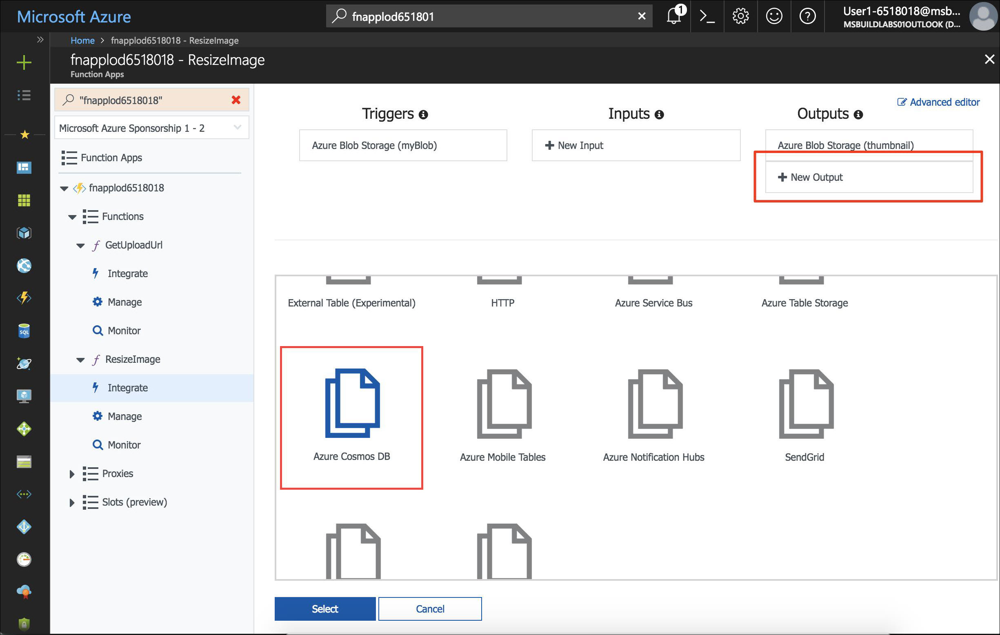
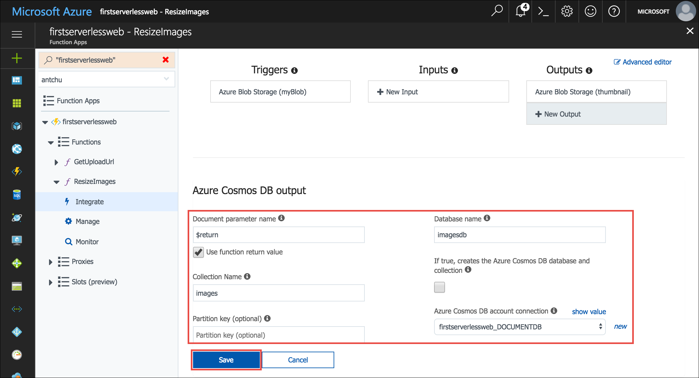
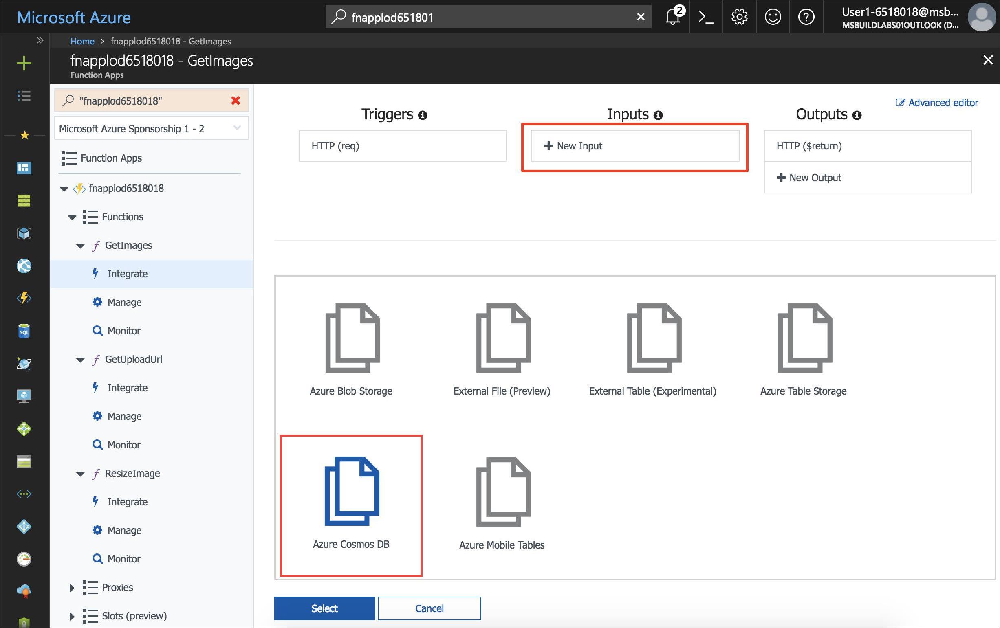
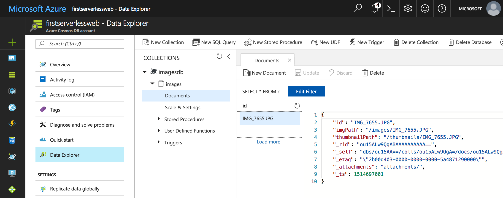

Azure Cosmos DB is Microsoft's serverless, globally distributed, multi-model database. In this module, you learn how to use Azure Functions to store and retrieve image metadata as JSON documents in Cosmos DB.

## Create a Cosmos DB account, database, and collection

A Cosmos DB account is an Azure resource that contains Cosmos DB databases.

1. Ensure you are still signed into the Cloud Shell.  If not, select **Enter focus mode** to open a Cloud Shell window. 

1. Create a Cosmos DB account with a unique name in the same resource group as the other resources in this tutorial.

    ```azurecli
    az cosmosdb create -g first-serverless-app -n <cosmos db account name>
    ```

1. After the Cosmos DB account is created, create a new database named **imagesdb** in the account.

    ```azurecli
    az cosmosdb database create -g first-serverless-app -n <cosmos db account name> --db-name imagesdb
    ```

1. After the database is created, create a new collection named **images** in the database with a throughput of 400 request units (RUs).

    ```azurecli
    az cosmosdb collection create -g first-serverless-app -n <cosmos db account name> --db-name imagesdb --collection-name images --throughput 400
    ```


## Save a document to Cosmos DB when a thumbnail is created

The Cosmos DB output binding lets you create documents in a Cosmos DB collection from Azure Functions. In the following steps, you configure a Cosmos DB output binding in the **ResizeImage** function and modify the function to return a document (object) to be saved.

1. Open the function app in the Azure Portal.

2. In the left hand navigation, expand the **ResizeImage** function, and then select **Integrate**.

3. Under **Outputs**, click **New Output**.

4. Find the **Azure Cosmos DB** item and select it. Then click **Select**.

    

5. Fill out the fields under **Azure Cosmos DB output** with the following values.


   |           Setting           |           Suggested value            |                          Description                          |
   |-----------------------------|--------------------------------------|---------------------------------------------------------------|
   | **Document parameter name** | Select **Use function return value** | The value of the textbox is automatically set to **$return**. |
   |      **Database name**      |               imagesdb               |        Use the name of the database that you created.         |
   |     **Collection name**     |                images                |       Use the name of the collection that you created.        |


6. Next to **Azure Cosmos DB account connection**, click **new**. Select the Cosmos DB account you previously created.

    

7. Click **Save** to create the Cosmos DB output binding.

8. Click on the **ResizeImage** function name on the left to open the function.

9. **C#**

    1. (C#) Change the return type of the function from **void** to **object**.

    1. (C#) At the end of the function, add the following code block to return the document to be saved:

        ```csharp
        return new {
            id = name,
            imgPath = "/images/" + name,
            thumbnailPath = "/thumbnails/" + name
        };
        ```

        

10. **JavaScript**

    1. (JavaScript) Change the `context.done()` statement in the `else` clause to return the document to be saved to Cosmos DB.

       ```javascript
       if (error) {
        context.done(error);
       } else {
        context.bindings.thumbnail = stream;
        context.done(null, {
            id: context.bindingData.name,
            imgPath: "/images/" + context.bindingData.name,
            thumbnailPath: "/thumbnails/" + context.bindingData.name
        });
       }
       ```

11. Click **Logs** below the code window to expand the logs panel.

12. Click **Save**. Check the logs panel to ensure the function is successfully saved and there are no errors.


## Create a function to list images from Cosmos DB

The web application requires an API to retrieve image metadata from Cosmos DB. In the following steps. you create an HTTP triggered function that uses a Cosmos DB input binding to query the database collection.

1. In your function app, hover over **Functions** on the left and click **+** to create a new function.

1. Find the **HttpTrigger** template and select it.

1. Use these values to create a function that generates a get images URL.

    | Setting      |  Suggested value   | Description                                        |
    | --- | --- | ---|
    | **Name your function** | GetImages | Type this name exactly as shown so the application can discover the function. |
    | **Authorization level** | Anonymous | Allow the function to be accessed publicly. |

1. Click **Create**.

1. When the new function is created, click **Integrate** under the function's name on the left navigation.

1. Click **New Input** and select **Azure Cosmos DB**. 

    

1. Click **Select**.

1. Fill out the following values:

    | Setting      |  Suggested value   | Description                                        |
    | --- | --- | ---|
    | **Document parameter name** | documents | Matches parameter name in the function. |
    | **Database name** | imagesdb |  |
    | **Collection name** | images |  |
    | **SQL query** | select * from c order by c._ts desc | Get documents, latest documents first. |
    | **Azure Cosmos DB account connection** | Select existing connection string |  |

1. Click **Save** to create the input binding.

1. **C#**

    1. Click the function's name to open the code window, and then replace all of **run.csx** with the content in [**/csharp/GetImages/run.csx**](https://raw.githubusercontent.com/Azure-Samples/functions-first-serverless-web-application/master/csharp/GetImages/run.csx).

1. **JavaScript**

    1. Click the function's name to open the code window, and then replace all of **index.js** with the content in [**/javascript/GetImages/index.js**](https://raw.githubusercontent.com/Azure-Samples/functions-first-serverless-web-application/master/javascript/GetImages/index.js).

1. Click **Logs** below the code window to expand the logs panel.

1. Click **Save**. Check the logs panel to ensure the function is successfully saved and there are no errors.


## Test the application

1. Open the application in a browser. Select an image file and upload it.

1. After a few seconds, the thumbnail of the new image appears on the page.

1. In the Azure portal, use the Search box to search for your Cosmos DB account by name. Click it to open it.

1. Click **Data Explorer** on the left to browse collections and documents.

1. Under the **imagesdb** database, select the **images** collection.

1. Confirm that a document was created for the uploaded image.

    


## Summary

In this module, you learned how to create a Cosmos DB account, database, and collection. You also learned how to use the Cosmos DB bindings to save and retrieve image metadata in the Cosmos DB collection. Next, you learn how to automatically generate a caption for each uploaded image using Microsoft Cognitive Services.
